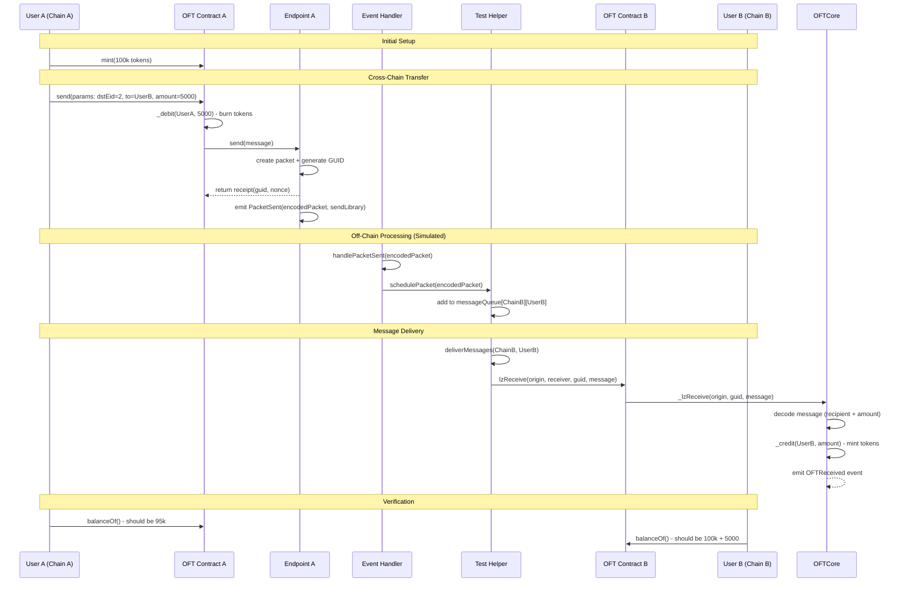

# Mini-LayerZero

[English](README.md) | [中文](README_CN.md)

A simplified, educational implementation of LayerZero's core concepts for cross-chain token transfers. This project extracts the essential logic from LayerZero's complex architecture to help developers understand the fundamental principles of cross-chain communication.

## 🎯 Why Mini-LayerZero?

LayerZero is a powerful cross-chain messaging protocol, but its complexity can be overwhelming for newcomers. This project aims to:

- **Simplify Learning**: Extract key concepts from complex logic to make LayerZero's core ideas accessible
- **Educational Focus**: Provide a working example that demonstrates cross-chain token transfer fundamentals
- **Code Clarity**: Show the essential flow without the overhead of production-ready features
- **Hands-on Experience**: Allow developers to run, modify, and understand the code step by step

## 🚀 How to Use This Repo

### Prerequisites
- [Foundry](https://getfoundry.sh/) installed
- Basic understanding of Solidity
- Familiarity with ERC20 tokens

### Quick Start
```bash
# Clone the repository
git clone <your-repo-url>
cd mini-layerzero

# Install dependencies
forge install

# Build the project
forge build

# Run tests
forge test
```

### Project Structure
```
mini-layerzero/
├── src/
│   ├── core/           # Core utilities (PacketCodec, AddressCast, etc.)
│   ├── interfaces/     # Contract interfaces
│   └── oft/           # OFT (Omnichain Fungible Token) implementation
├── test/
│   ├── helpers/       # Test helper contracts
│   └── OFT.t.sol      # Main test file
└── README.md
```

## 🔄 What This Project Covers

### Core Concepts Implemented
1. **Cross-Chain Token Transfer**: Complete flow from Chain A to Chain B
2. **Packet Encoding/Decoding**: How messages are serialized for cross-chain transmission
3. **Endpoint Communication**: Basic endpoint contract for message handling
4. **OFT Standard**: Omnichain Fungible Token implementation
5. **Event Processing**: How off-chain systems process cross-chain events
6. **Message Queue**: Simple message queuing and delivery system

### Key Components
- **OFTCore**: Abstract base contract for cross-chain token operations
- **PacketCodec**: Library for encoding/decoding cross-chain messages
- **Endpoint**: Simplified endpoint contract for message routing
- **DecimalConverter**: Handles precision differences between chains
- **AddressCast**: Utilities for address type conversions

## ❌ What This Project Doesn't Cover

### Production Features (Intentionally Omitted)
- **Security Validations**: No message verification, replay protection, fraud proofs, DVN (Data Validation Network), or Executor configuration
- **Relayer Infrastructure**: No actual cross-chain message relaying
- **Gas Management**: No gas fee handling or optimization
- **Fee Quoting**: No cross-chain fee calculation or quote system
- **Error Recovery**: Limited error handling and recovery mechanisms
- **Multi-Chain Support**: Only demonstrates 2-chain scenario
- **Advanced Routing**: No complex message routing or fallback mechanisms
- **OFT Adapter Solutions**: No OFT adapter implementations for different token standards

### Why These Are Omitted
These features add significant complexity and are better understood after mastering the core concepts. This project focuses on the **fundamental flow** rather than production-ready features.

## 📊 Sequence Chart

Based on the test case `test_SendAndDeliver()`, here's the complete cross-chain flow:



## 🧪 How to Run Tests and Understand the Logic

### Step 1: Run the Basic Test
```bash
forge test -vv
```
This will show you the basic flow with gas usage and basic logs.

### Step 2: Run with Detailed Logs
```bash
forge test -vvvv
```
This provides comprehensive trace information, showing every function call and state change.

### Step 3: Understand the Flow Step by Step

#### Phase 1: Setup
```solidity
// test/OFT.t.sol - setUp()
function setUp() public {
    // Creates two chains (Chain A and Chain B)
    // Deploys endpoints for each chain
    // Deploys OFT contracts on each chain
    // Sets up peer relationships between chains
    // Mints initial tokens to User A
}
```

#### Phase 2: Cross-Chain Send
```solidity
// User A sends tokens to Chain B
IOFT.OFTReceipt memory oftReceipt = oftA.send(params);
```
**What happens:**
1. Tokens are burned from User A on Chain A
2. Message is built and sent to Endpoint A
3. Endpoint A creates a packet with unique GUID
4. `PacketSent` event is emitted

#### Phase 3: Event Processing
```solidity
// Simulates off-chain event processing
_processPacketSentEvents(address(endpointA));
```
**What happens:**
1. Captures `PacketSent` events
2. Decodes the packet data
3. Schedules the message for delivery

#### Phase 4: Message Delivery
```solidity
// Delivers the message to Chain B
testHelper.deliverMessages(CHAIN_B, address(oftB));
```
**What happens:**
1. Message is retrieved from queue
2. `lzReceive` is called on Chain B
3. Tokens are minted to User B on Chain B

### Step 4: Modify and Experiment

#### Try Different Amounts
```solidity
// In test_SendAndDeliver()
uint256 transferAmount = 10000 * 10 ** 18; // Try 10k instead of 5k
```

#### Add More Logging
```solidity
// Add console.log statements to see intermediate values
console.log("Packet GUID:", packet.guid);
console.log("Message length:", packet.message.length);
```

#### Test Error Conditions
```solidity
// Try sending to an invalid chain
params.dstEid = 999; // Non-existent chain
```

### Step 5: Understand Key Concepts

#### 1. **Packet Structure**
```solidity
// src/core/PacketCodec.sol
struct Packet {
    uint64 nonce;       // Message sequence number
    uint32 srcEid;      // Source chain ID
    address sender;     // Sender address
    uint32 dstEid;      // Destination chain ID
    bytes32 receiver;   // Receiver address
    bytes32 guid;       // Global unique identifier
    bytes message;      // Message content
}
```

#### 2. **Message Encoding**
```solidity
// How messages are packed for cross-chain transmission
function encode(Packet memory _packet) internal pure returns (bytes memory) {
    return abi.encodePacked(
        _packet.nonce,
        _packet.srcEid,
        _packet.sender,
        _packet.dstEid,
        _packet.receiver,
        _packet.guid,
        _packet.message
    );
}
```

#### 3. **Cross-Chain Flow**
```solidity
// The core send function
function send(SendParam calldata _sendParam) external returns (OFTReceipt memory receipt) {
    // 1. Validate peer exists
    // 2. Debit tokens from sender
    // 3. Build cross-chain message
    // 4. Send via endpoint
    // 5. Return receipt
}
```

## 🔍 Key Learning Points

### 1. **Message Lifecycle**
- **Creation**: User initiates cross-chain transfer
- **Encoding**: Message is serialized into bytes
- **Transmission**: Message is sent via endpoint
- **Processing**: Off-chain systems capture and process events
- **Delivery**: Message is delivered to destination chain
- **Execution**: Tokens are minted on destination

### 2. **State Management**
- **Source Chain**: Tokens are burned (debit)
- **Destination Chain**: Tokens are minted (credit)
- **Message Queue**: Pending messages are stored
- **Processing Status**: Messages are tracked to prevent duplicates

### 3. **Cross-Chain Communication**
- **Events**: Primary mechanism for cross-chain communication
- **Packets**: Structured data format for message transmission
- **GUIDs**: Unique identifiers for message tracking
- **Endpoints**: Contract interfaces for message routing

## 🚧 Limitations and Next Steps

### Current Limitations
- Single test scenario (A → B transfer)
- No error handling or edge cases
- Simplified security model
- Limited to two chains

### Planed Improvements
1. **Security Infrastructure**: Add DVN (Data Validation Network) and Executor configuration
2. **Fee Quote**: Implement cross-chain fee calculation and quoting system
3. **Integration Tests**: Test with actual testnets

## 📚 Further Reading

- [LayerZero Documentation](https://layerzero.network/)
- [OFT Standard](https://docs.layerzero.network/v2/developers/evm/oft/quickstart)
- [Foundry Book](https://book.getfoundry.sh/)
- [Solidity Documentation](https://docs.soliditylang.org/)

## 🤝 Contributing

This is an educational project. Feel free to:
- Submit issues for unclear concepts
- Propose improvements to the documentation
- Add more test scenarios
- Enhance the code with additional features

## 📄 License

MIT License - see LICENSE file for details.

---

**Happy Learning! 🎉**

This project demonstrates that cross-chain communication doesn't have to be complex to understand. Start here, then explore the full LayerZero ecosystem when you're ready for production features.
