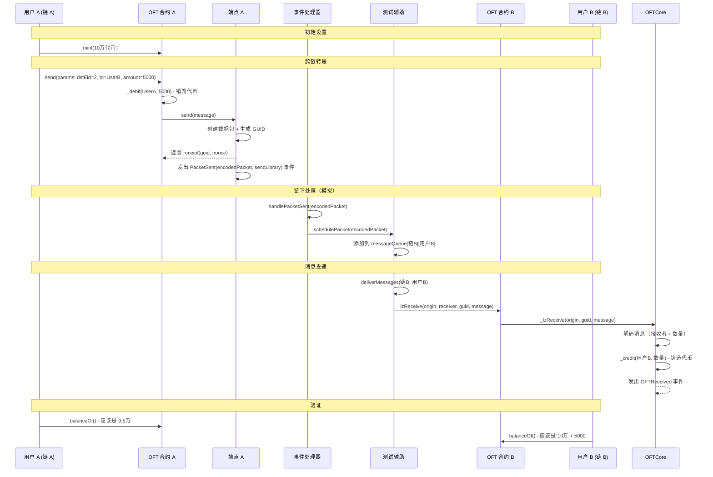

# Mini-LayerZero

[English](README.md) | [中文](README_CN.md)

LayerZero 核心概念的简化教育实现，用于跨链代币转账。本项目从 LayerZero 复杂架构中提取核心逻辑，帮助开发者理解跨链通信的基本原理。

## 🎯 为什么做 Mini-LayerZero？

LayerZero 是一个强大的跨链消息协议，但其复杂性可能让新手望而生畏。本项目旨在：

- **简化学习**：从复杂逻辑中提取关键概念，让 LayerZero 的核心思想更容易理解
- **教育导向**：提供演示跨链代币转账基础的工作示例
- **代码清晰**：展示核心流程，不包含生产就绪功能的开销
- **动手实践**：允许开发者运行、修改和逐步理解代码

## 🚀 如何使用这个 Repo

### 前置要求
- 安装 [Foundry](https://getfoundry.sh/)
- 基本的 Solidity 理解
- 熟悉 ERC20 代币

### 快速开始
```bash
# 克隆仓库
git clone <your-repo-url>
cd mini-layerzero

# 安装依赖
forge install
pnpm install

# 构建项目
forge build

# 运行测试
forge test
```

### 项目结构
```
mini-layerzero/
├── src/
│   ├── core/           # 核心工具 (PacketCodec, AddressCast 等)
│   ├── interfaces/     # 合约接口
│   └── oft/           # OFT (全链同质化代币) 实现
├── test/
│   ├── helpers/       # 测试辅助合约
│   └── OFT.t.sol      # 主测试文件
└── README.md
```

## 🔄 这个项目覆盖了什么

### 实现的核心概念
1. **跨链代币转账**：从链 A 到链 B 的完整流程
2. **数据包编码/解码**：消息如何序列化用于跨链传输
3. **端点通信**：消息处理的基本端点合约
4. **OFT 标准**：全链同质化代币实现
5. **事件处理**：链下系统如何处理跨链事件
6. **消息队列**：简单的消息排队和投递系统

### 关键组件
- **OFTCore**：跨链代币操作的抽象基础合约
- **PacketCodec**：跨链消息编码/解码库
- **Endpoint**：消息路由的简化端点合约
- **DecimalConverter**：处理链间精度差异
- **AddressCast**：地址类型转换工具

## ❌ 这个项目没有覆盖什么

### 生产功能（有意省略）
- **安全验证**：没有消息验证、重放保护、欺诈证明、DVN（数据验证网络）或执行器配置
- **中继器基础设施**：没有实际的跨链消息中继
- **Gas 管理**：没有 gas 费用处理或优化
- **费用报价**：没有跨链费用计算或报价系统
- **错误恢复**：有限的错误处理和恢复机制
- **多链支持**：仅演示 2 链场景
- **高级路由**：没有复杂的消息路由或回退机制
- **OFT 适配器解决方案**：没有针对不同代币标准的 OFT 适配器实现

### 为什么省略这些
这些功能增加了显著的复杂性，在掌握核心概念后更容易理解。本项目专注于**基本流程**而不是生产就绪功能。

## 📊 序列图

基于测试用例 `test_SendAndDeliver()`，这是完整的跨链流程：



## 🧪 如何运行测试和理解逻辑

### 第 1 步：运行基本测试
```bash
forge test -vv
```
这将显示基本流程，包括 gas 使用和基本日志。

### 第 2 步：运行详细日志
```bash
forge test -vvvv
```
这提供全面的跟踪信息，显示每个函数调用和状态变化。

### 第 3 步：逐步理解流程

#### 阶段 1：设置
```solidity
// test/OFT.t.sol - setUp()
function setUp() public {
    // 创建两个链（链 A 和链 B）
    // 为每个链部署端点
    // 在每个链上部署 OFT 合约
    // 设置链间对等关系
    // 为用户 A 铸造初始代币
}
```

#### 阶段 2：跨链发送
```solidity
// 用户 A 发送代币到链 B
IOFT.OFTReceipt memory oftReceipt = oftA.send(params);
```
**发生了什么：**
1. 在链 A 上销毁用户 A 的代币
2. 构建消息并发送到端点 A
3. 端点 A 创建带有唯一 GUID 的数据包
4. 发出 `PacketSent` 事件

#### 阶段 3：事件处理
```solidity
// 模拟链下事件处理
_processPacketSentEvents(address(endpointA));
```
**发生了什么：**
1. 捕获 `PacketSent` 事件
2. 解码数据包数据
3. 调度消息进行投递

#### 阶段 4：消息投递
```solidity
// 将消息投递到链 B
testHelper.deliverMessages(CHAIN_B, address(oftB));
```
**发生了什么：**
1. 从队列中检索消息
2. 在链 B 上调用 `lzReceive`
3. 在链 B 上为用户 B 铸造代币

### 第 4 步：修改和实验

#### 尝试不同数量
```solidity
// 在 test_SendAndDeliver() 中
uint256 transferAmount = 10000 * 10 ** 18; // 尝试 1万而不是 5千
```

#### 添加更多日志
```solidity
// 添加 console.log 语句来查看中间值
console.log("数据包 GUID:", packet.guid);
console.log("消息长度:", packet.message.length);
```

#### 测试错误条件
```solidity
// 尝试发送到无效链
params.dstEid = 999; // 不存在的链
```

### 第 5 步：理解关键概念

#### 1. **数据包结构**
```solidity
// src/core/PacketCodec.sol
struct Packet {
    uint64 nonce;       // 消息序号
    uint32 srcEid;      // 源链 ID
    address sender;     // 发送者地址
    uint32 dstEid;      // 目标链 ID
    bytes32 receiver;   // 接收者地址
    bytes32 guid;       // 全局唯一标识符
    bytes message;      // 消息内容
}
```

#### 2. **消息编码**
```solidity
// 消息如何打包用于跨链传输
function encode(Packet memory _packet) internal pure returns (bytes memory) {
    return abi.encodePacked(
        _packet.nonce,
        _packet.srcEid,
        _packet.sender,
        _packet.dstEid,
        _packet.receiver,
        _packet.guid,
        _packet.message
    );
}
```

#### 3. **跨链流程**
```solidity
// 核心发送函数
function send(SendParam calldata _sendParam) external returns (OFTReceipt memory receipt) {
    // 1. 验证对等方存在
    // 2. 从发送者扣除代币
    // 3. 构建跨链消息
    // 4. 通过端点发送
    // 5. 返回收据
}
```

## 🔍 关键学习要点

### 1. **消息生命周期**
- **创建**：用户发起跨链转账
- **编码**：消息序列化为字节
- **传输**：消息通过端点发送
- **处理**：链下系统捕获和处理事件
- **投递**：消息投递到目标链
- **执行**：在目标链上铸造代币

### 2. **状态管理**
- **源链**：代币被销毁（扣除）
- **目标链**：代币被铸造（贷记）
- **消息队列**：待处理消息被存储
- **处理状态**：消息被跟踪以防止重复

### 3. **跨链通信**
- **事件**：跨链通信的主要机制
- **数据包**：消息传输的结构化数据格式
- **GUID**：消息跟踪的唯一标识符
- **端点**：消息路由的合约接口

## 🚧 局限性和下一步

### 当前局限性
- 单一测试场景（A → B 转账）
- 没有错误处理或边界情况
- 简化的安全模型
- 仅限于两个链

### 计划改进
1. **安全基础设施**：添加 DVN（数据验证网络）和执行器配置
2. **费用报价**：实现跨链费用计算和报价系统
3. **集成测试**：使用实际测试网进行测试

## 📚 进一步阅读

- [LayerZero 文档](https://layerzero.network/)
- [OFT 标准](https://docs.layerzero.network/v2/developers/evm/oft/quickstart)
- [Foundry 手册](https://book.getfoundry.sh/)
- [Solidity 文档](https://docs.soliditylang.org/)

## 🤝 贡献

这是一个教育项目。欢迎：
- 为不清楚的概念提交问题
- 提出文档改进建议
- 添加更多测试场景
- 用附加功能增强代码

## 📄 许可证

MIT 许可证 - 详见 LICENSE 文件。

---

**快乐学习！🎉**

本项目证明跨链通信不必复杂到难以理解。从这里开始，然后在你准备好生产功能时探索完整的 LayerZero 生态系统。
